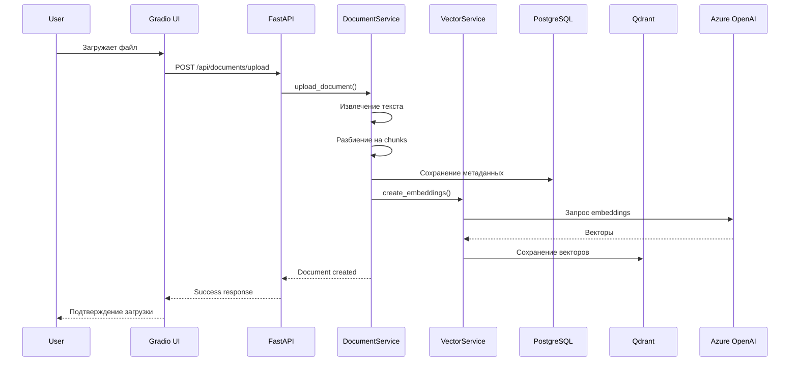
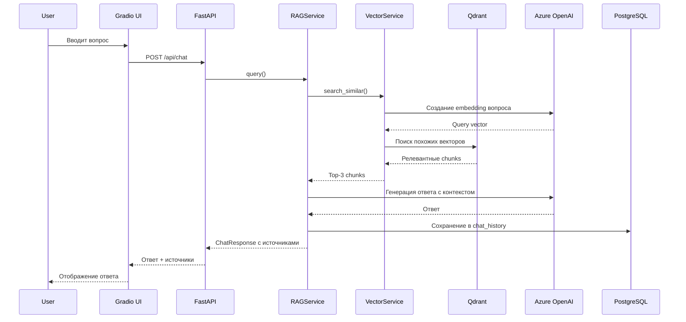
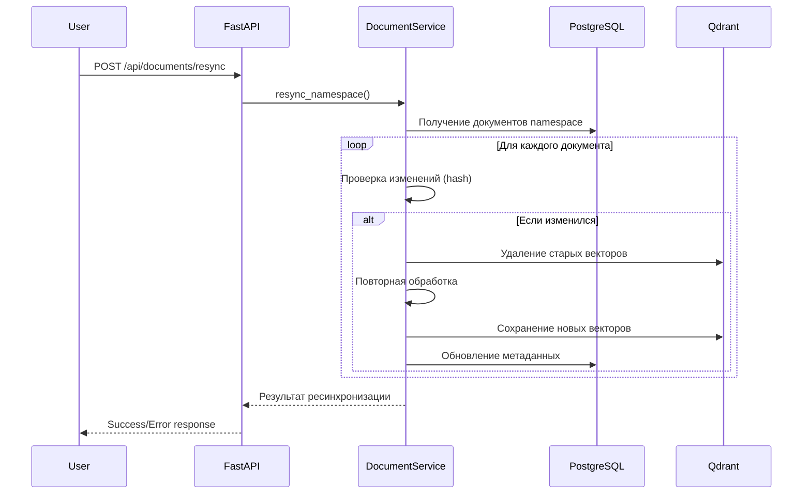

# Архитектурный дизайн RAG микросервиса

## Обзор архитектуры

Система построена по принципу модульной архитектуры с четким разделением ответственности между компонентами.

## Компоненты системы

### 1. Веб-интерфейс (Gradio)
**Назначение**: Пользовательский интерфейс для загрузки документов и чата

**Функции**:
- Загрузка файлов через drag&drop
- Интерфейс чата с историей
- Управление namespace и ресинхронизацией
- Просмотр списка документов

**Технологии**: Gradio 4.7+, встроен в FastAPI

### 2. API слой (FastAPI)
**Назначение**: REST API для внешних интеграций и внутреннего взаимодействия

**Endpoints**:
```
/api/documents/upload     - Загрузка документа
/api/documents           - CRUD операции с документами
/api/documents/resync    - Ресинхронизация
/api/chat               - Чат API
/api/health             - Health checks
```

**Технологии**: FastAPI, Pydantic для валидации

### 3. Сервисный слой
**Назначение**: Бизнес-логика приложения

#### 3.1 DocumentService
```python
class DocumentService:
    def upload_document(file, metadata) -> Document
    def process_document(document_id) -> List[DocumentChunk]
    def resync_namespace(namespace) -> bool
    def delete_document(document_id) -> bool
```

#### 3.2 RAGService
```python
class RAGService:
    def query(question: str, namespace: str = None) -> ChatResponse
    def get_relevant_chunks(query: str, top_k: int = 3) -> List[DocumentChunk]
    def generate_response(query: str, chunks: List[DocumentChunk]) -> str
```

#### 3.3 VectorService
```python
class VectorService:
    def create_embeddings(text: str) -> List[float]
    def store_chunks(chunks: List[DocumentChunk]) -> bool
    def search_similar(query_vector: List[float], top_k: int) -> List[SearchResult]
    def delete_document_vectors(document_id: int) -> bool
```

### 4. Слой данных

#### 4.1 PostgreSQL (Метаданные)
**Таблицы**:
- `documents` - метаданные документов
- `document_chunks` - информация о chunks
- `chat_history` - история диалогов

**Схема**:
```sql
-- Документы
CREATE TABLE documents (
    id SERIAL PRIMARY KEY,
    title VARCHAR(500) NOT NULL,
    source_type VARCHAR(50) NOT NULL,
    namespace VARCHAR(255) NOT NULL,
    source_url TEXT,
    content_hash VARCHAR(64) NOT NULL,
    metadata JSONB,
    created_at TIMESTAMP WITH TIME ZONE DEFAULT NOW(),
    updated_at TIMESTAMP WITH TIME ZONE,
    is_active BOOLEAN DEFAULT TRUE
);

-- Chunks документов
CREATE TABLE document_chunks (
    id SERIAL PRIMARY KEY,
    document_id INTEGER REFERENCES documents(id),
    chunk_index INTEGER NOT NULL,
    content TEXT NOT NULL,
    vector_id VARCHAR(255) UNIQUE NOT NULL,
    metadata JSONB,
    created_at TIMESTAMP WITH TIME ZONE DEFAULT NOW()
);

-- История чатов
CREATE TABLE chat_history (
    id SERIAL PRIMARY KEY,
    session_id VARCHAR(255),
    user_message TEXT NOT NULL,
    assistant_message TEXT NOT NULL,
    sources_used JSONB,
    created_at TIMESTAMP WITH TIME ZONE DEFAULT NOW()
);
```

#### 4.2 Qdrant (Векторное хранилище)
**Назначение**: Хранение векторных представлений chunks документов

**Коллекции**:
- `documents` - основная коллекция с векторами
- Конфигурация: 1536 измерений (Azure OpenAI embeddings)

### 5. Внешние сервисы

#### 5.1 Azure OpenAI
**Модели**:
- `text-embedding-ada-002` - для создания embeddings
- `gpt-4` - для генерации ответов

**Интеграция**: через llama-index Azure OpenAI connector

## Потоки данных

### 1. Загрузка документа



### 2. Чат-запрос



### 3. Ресинхронизация



## Принципы дизайна

### 1. Разделение ответственности
- **API слой**: только маршрутизация и валидация
- **Сервисный слой**: вся бизнес-логика
- **Слой данных**: только хранение и извлечение

### 2. Dependency Injection
```python
# Пример внедрения зависимостей
class DocumentService:
    def __init__(
        self,
        db_session: Session,
        vector_service: VectorService,
        text_processor: TextProcessor
    ):
        self.db = db_session
        self.vector_service = vector_service
        self.text_processor = text_processor
```

### 3. Error Handling
- Graceful degradation при недоступности внешних сервисов
- Подробное логирование ошибок
- Информативные сообщения для пользователя

### 4. Конфигурация
- Все настройки через environment variables
- Pydantic Settings для валидации конфигурации
- Разные конфигурации для dev/prod

### 5. Тестируемость
- Мокирование внешних зависимостей
- Интеграционные тесты с тестовой БД
- Unit тесты для бизнес-логики

## Масштабируемость

### Текущие ограничения
- Один инстанс приложения
- Локальная файловая система для временных файлов
- Нет кэширования результатов

### Планы на будущее
- Горизонтальное масштабирование (несколько инстансов)
- Объектное хранилище для файлов (S3/MinIO)
- Redis для кэширования embeddings
- Load balancer для распределения нагрузки

## Мониторинг и наблюдаемость

### Логирование
- Структурированные логи (JSON)
- Корреляционные ID для трейсинга запросов
- Разные уровни логирования по компонентам

### Метрики (будущие версии)
- Время ответа API endpoints
- Количество обработанных документов
- Использование векторного хранилища
- Метрики качества RAG (релевантность ответов)

### Health Checks
```python
@app.get("/api/health")
async def health_check():
    return {
        "status": "healthy",
        "database": await check_database(),
        "qdrant": await check_qdrant(),
        "azure_openai": await check_azure_openai()
    }
``` 